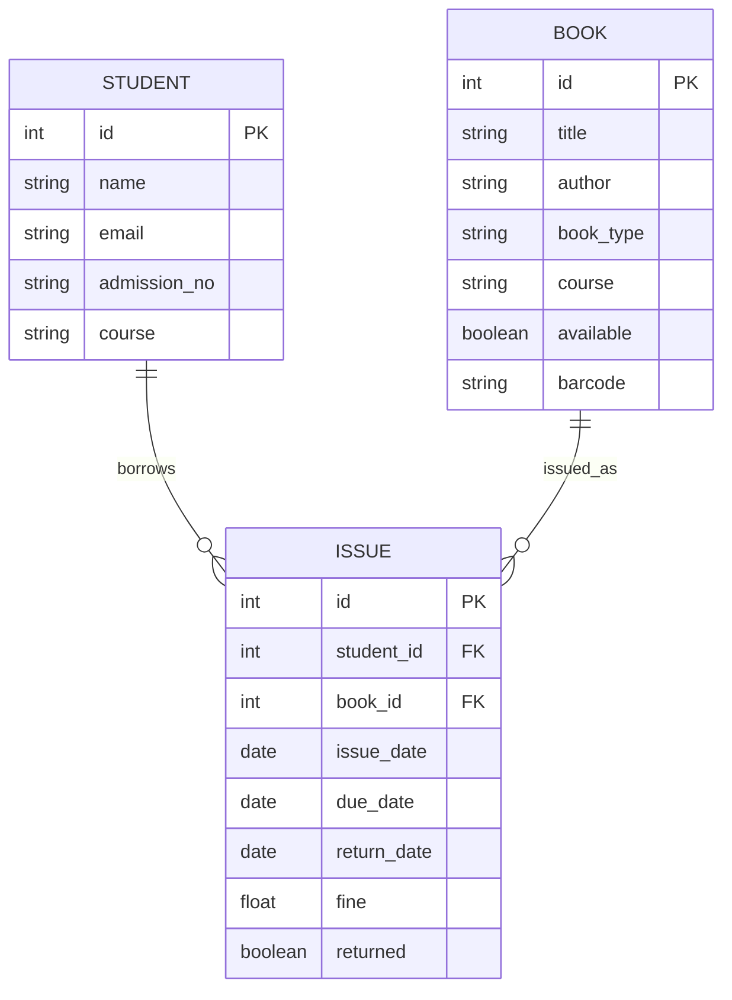

<div align="center">

# 📚 Bibliotech - Library Management System

### *Empowering Libraries, Enabling Knowledge*

[](https://python.org)
[](https://flask.palletsprojects.com/)
[](https://sqlite.org)
[](LICENSE)

<p align="center">
  <strong>A modern, intuitive library management solution designed for educational institutions</strong>
</p>

---

[Features](#-features) • [Installation](#-installation) • [Usage](#-usage) • [Tech Stack](#-tech-stack) • [Contributing](#-contributing)

</div>

---

## 🌟 About The Project

**Bibliotech** is a comprehensive, full-stack Library Management System crafted to streamline and modernize library operations in colleges and universities. Built with a focus on user experience and operational efficiency, it seamlessly manages the complete lifecycle of library resources—from book cataloging to student interactions.

> *"A library is not a luxury but one of the necessities of life."* — Henry Ward Beecher

### 🎯 Why Bibliotech?

| Challenge | Our Solution |
|-----------|-------------|
| 📋 Manual book tracking | Automated inventory management with real-time availability |
| ⏰ Late return chaos | Smart fine calculation with visual overdue indicators |
| 🔍 Finding relevant books | Course-curriculum book mapping for academic alignment |
| 👥 Student record management | Comprehensive student profiles with borrowing history |

---

## ✨ Features

<table>
<tr>
<td width="50%">

### 📖 Book Management
- Add, update, and delete books
- Track availability in real-time
- Categorize as Textbook or Reference
- Map books to course curriculum

</td>
<td width="50%">

### 👨‍🎓 Student Management
- Complete student profiles
- View borrowing history
- Track currently issued books
- Quick search by admission number

</td>
</tr>
<tr>
<td width="50%">

### 🔄 Issue & Return System
- One-click book issuance
- Automatic 14-day due date
- Smart return processing
- Visual overdue alerts

</td>
<td width="50%">

### 💰 Fine Management
- Automatic fine calculation
- ₹5/day late fee policy
- Fine history tracking
- Integrated in student profile

</td>
</tr>
</table>

### 🎨 Modern UI/UX
- 🌙 Elegant purple-themed design
- 📱 Fully responsive interface
- ⚡ Smooth animations & transitions
- 🧭 Intuitive navigation sidebar

---

## 🚀 Installation

### Prerequisites

Before you begin, ensure you have the following installed:
- **Python 3.7+** - [Download Python](https://www.python.org/downloads/)
- **pip** - Python package manager (included with Python)
- **Git** - [Download Git](https://git-scm.com/downloads)

### Quick Start

```bash
# 1️⃣ Clone the repository
git clone https://github.com/punit745/Library-Management-System.git
cd Library-Management-System

# 2️⃣ Create virtual environment
python -m venv venv

# 3️⃣ Activate virtual environment
# On Windows:
venv\Scripts\activate
# On macOS/Linux:
source venv/bin/activate

# 4️⃣ Install dependencies
pip install -r requirements.txt

# 5️⃣ Initialize the database
python init_db.py

# 6️⃣ (Optional) Load sample data
python seed_data.py

# 7️⃣ Run the application
flask run
```

### 🎉 Access Your Application

Open your browser and navigate to:
```
http://127.0.0.1:5000
```

> **💡 Tip:** If you encounter any issues, check the [Troubleshooting](#-troubleshooting) section below.

---

## 📖 Usage Guide

### 📚 Managing Books

1. Navigate to **Books** from the sidebar
2. Fill in book details (title, author, type, course)
3. Click **Add Book** to register
4. View all books with availability status
5. Delete books using the trash icon

### 👥 Managing Students

1. Navigate to **Students** from the sidebar
2. Add students with name, email, admission number, and course
3. Click on **Profile** to view complete student details
4. Search students by admission number for quick access

### 🔄 Issue & Return Books

1. Navigate to **Issue/Return** section
2. Search student by admission number → redirects to profile
3. Issue books directly from student profile
4. View issued books with due dates
5. Return books with automatic fine calculation

---

## 📁 Project Structure

```
📦 Library-Management-System
├── 📄 app.py                 # Application entry point
├── 📄 models.py              # Database models
├── 📄 config.py              # Configuration settings
├── 📄 init_db.py             # Database initialization
├── 📄 seed_data.py           # Sample data seeder
├── 📄 requirements.txt       # Python dependencies
│
├── 📂 routes/                # Route handlers
│   ├── __init__.py
│   ├── book_routes.py        # Book CRUD operations
│   ├── student_routes.py     # Student management
│   └── issue_routes.py       # Issue/return logic
│
├── 📂 templates/             # Jinja2 HTML templates
│   ├── base.html             # Base layout
│   ├── home.html             # Dashboard
│   ├── manage_books.html     # Book management
│   ├── manage_students.html  # Student management
│   ├── issue_books.html      # Issue/return page
│   └── student_profile.html  # Student profile view
│
├── 📂 static/                # Static assets
│   ├── css/
│   └── images/
│
└── 📂 instance/              # SQLite database (auto-generated)
```

---

## 🛠 Tech Stack

<div align="center">

| Category | Technology |
|----------|------------|
| **Backend** |   |
| **Database** |   |
| **Frontend** |    |
| **Templating** |  |

</div>

---

## 🗄 Database Schema



---

## 🔧 Troubleshooting

<details>
<summary><b>❌ Internal Server Error after cloning</b></summary>

This usually means the database hasn't been initialized. Run:
```bash
python init_db.py
```
</details>

<details>
<summary><b>❌ ModuleNotFoundError</b></summary>

Make sure you've activated the virtual environment and installed dependencies:
```bash
venv\Scripts\activate  # Windows
pip install -r requirements.txt
```
</details>

<details>
<summary><b>❌ Database tables not found</b></summary>

Delete the `instance` folder and reinitialize:
```bash
rmdir /s instance  # Windows
python init_db.py
python seed_data.py  # Optional: add sample data
```
</details>

---

## 🚀 Future Roadmap

- [ ] 🔐 User authentication & role-based access
- [ ] 📧 Email notifications for due dates
- [ ] 📊 Analytics dashboard with charts
- [ ] 📱 Mobile-responsive PWA
- [ ] 🔍 Advanced search with filters
- [ ] 📄 Export reports (PDF/CSV)
- [ ] 📷 Barcode scanning integration
- [ ] 🌐 Multi-language support

---

## 🤝 Contributing

Contributions make the open-source community an amazing place to learn, inspire, and create. Any contributions you make are **greatly appreciated**.

1. Fork the Project
2. Create your Feature Branch (`git checkout -b feature/AmazingFeature`)
3. Commit your Changes (`git commit -m 'Add some AmazingFeature'`)
4. Push to the Branch (`git push origin feature/AmazingFeature`)
5. Open a Pull Request

---

## 📝 License

Distributed under the **MIT License**. See `LICENSE` for more information.

---

## 📬 Contact & Support

<div align="center">

**Have questions or suggestions?**

[](https://github.com/punit745/Library-Management-System/issues)

</div>

---

<div align="center">

### ⭐ Star this repo if you found it helpful!

Made with ❤️ by [Punit](https://github.com/punit745)

</div>